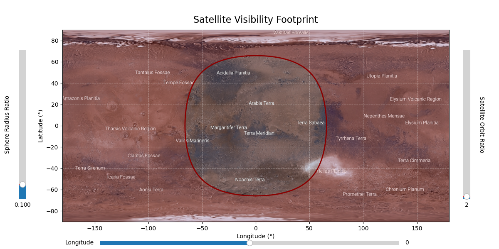

# SatVisMars
An educational tool to visualize the visibility of satellites 🌕 from the surface of Mars.

Mars has two moons--Phobos and Deimos—-but you're not restricted to only the parameters of the exisiting moons! Usse sliders to play around with different combinations of the distance and size of the satellite. 

## How to run
pip install the package in development 

`pip install SatVisMars` 

`SatVisMars`

